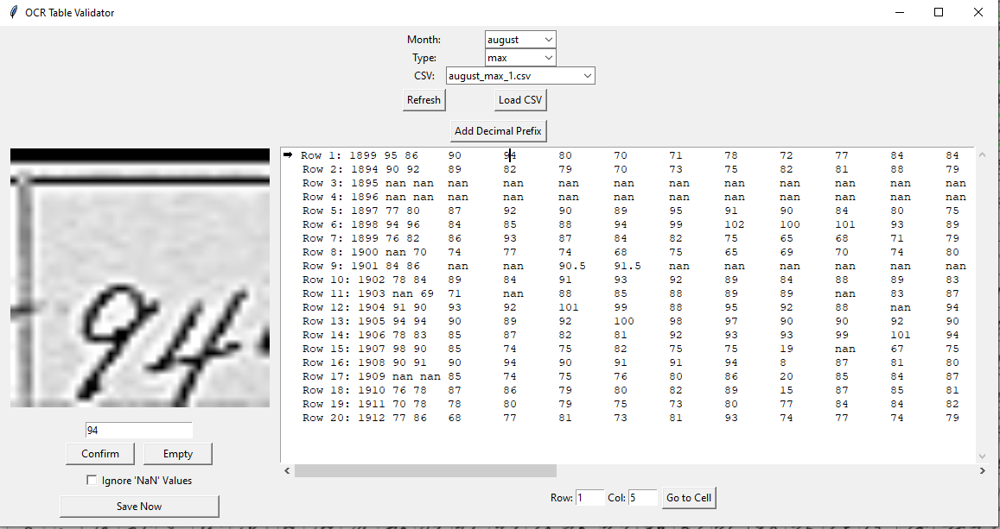

# OCRpipeline
This project is a user-guided OCR pipeline designed for extracting structured data from scanned, handwritten tables. It is especially effective for digitizing legacy documents such as agricultural logs, historical field notebooks, or other analog forms where automated OCR tools typically fail.

## Features

- **Manual Table Segmentation** – Visually define rows and columns on scanned images using an interactive drawing tool.
- **OCR with Google Cloud Vision** – Automatically extracts text from each segmented cell using the Google Cloud Vision API.
- **Correction & Validation Interface** – Review OCR results cell-by-cell alongside the image snippet; confirm or correct in real time.
- **Outlier Detection** – Highlights statistically unusual entries for manual review.
- **CSV Export** – Outputs clean, structured data ready for analysis or database ingestion.

## Dependencies

- **Python 3.x**
- **OpenCV**
- **TKinter**
- **Pandas**
- **Pillow**
- **Google Cloud Vision API Client**
```bash
pip install -r requirements.txt
```

## How to Run

### 1. Add Google Cloud Vision API Key

Place your `.json` key file from google cloud console in the `key/` folder. The application will automatically find and use it.

### 2. Launch the Application

```bash
python app.py
```

## Why Manual Segmentation?

Fully automatic OCR solutions often fail on poorly scanned, handwritten, or skewed tables. This tool allows users to guide the segmentation process, ensuring accurate structure detection and higher OCR reliability.

## APP Preview


### Segmentation Grid

#### Mouse Controls

- **Left Click** - Draw a grid line (either horizontal or vertical depending on mode)
- **Right Click** - Undo the last grid line

#### Keyboard Controls

- **Any Key** - Switch from drawing horizontal (row), to vertical (column) grid lines, and then to finish
  
#### Rotate Mode

- Press **R** – Enter rotate mode  
  - Press **R** – Rotate image clockwise  
  - Press **L** – Rotate image counter-clockwise  
  - Press **Enter** – Exit rotate mode

  


### Validator

